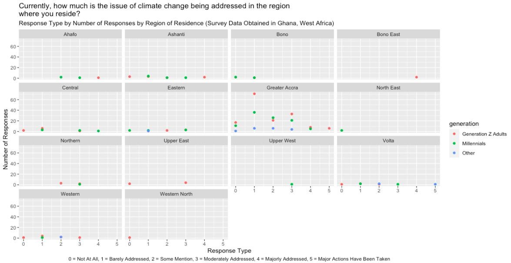

# About the Research

Column {data-width=350}
-----------------------------------------------------------------------

### **Researchers:** 

Samantha Lorenzo & Laura Gattis

### **Synopsis:**

Climate change continues to be perceived as a significant risk, especially 
among younger demographics.For this study, my co-investigator and I plan on 
further exploring the impact climate change messages have on Millennials and 
Generation Z adults and the influence these messages have on the group’s 
decision of whether or not to have children. Drawing inspiration from the idea 
of risk being perceived as a reaction to danger (*Risk as feelings*) and risk 
being perceived through reasoning (*Risk as analysis*), as well as Stuart Hall’s 
Reception Theory, we anticipate uncovering correlations between the way climate 
change messages are encoded by communicators and decoded by Millennials. In 
doing so, a blending and expansion of these existing concepts may occur, 
introducing a new evolution of theoretical framework, specifically in climate 
change communication and decision making. We hypothesize that the way in which 
media messages about climate change are framed and interpreted negatively 
impacts Millennial and Generation Z perceptions about having children.

### **Specific Aims/Study Objectives:**

This initial study aims to be the steppingstone for multiple replications conducted in different
countries. Over the summer, we conducted the study with Millennials and Generation Z adults living
in Ghana. Later in the school year, we hope to duplicate the study with Millennials and Generation Z
adults living in the United States. The overall purpose is to compare climate change and family
perceptions among emerging consumers and observe if correlations exist between demographics
across the globe. This analysis intends to answer the following research question: What effect do
messages about climate change have on Millennials and Generation Z and their desire to have
children?

The goal is to provide a comprehensive overview of this trend by focusing on three main
areas: (1) views of climate change among Millennials and Generation Z, (2) the distribution and
subsequent interpretation of media messages on climate change, and (3) the impact these perceptions
have on family planning.

### **Data Visualization Plan** 

For this class, I will be utilizing the data collected to quantitatively determine if there are any
correlations between views among demographics and to see if responses tend to skew towards
specific perceptions (e.g., high fear of climate change, low desire to have children). My plan is to use
our data to better visualize participant responses (graphs, charts) and categorize information into a
variety of sets (tables, filtering). This will be my second round of data analyzation for this specific
study. Last term, I had only 130 survey responses at my disposal that my team used to create
preliminary graphs in EDLD651. This term, I have nearly three times as many responses to evaluate and I will
be producing a whole new set of visuals to represent new findings.

```{r setup, include=FALSE}
library(flexdashboard)
```

# Research Question 1: How concerned are you about climate change?

Column {data-width=650}
-----------------------------------------------------------------------

### First Draft

I originally plotted a visual to show response type (based on a Likert-type scale from 0-5) by number of responses.


### Final Draft
I re-coded the values of the Likert scale to match the values in the survey. I then stacked the values to show total responses for each option based on generation.


# Research Question 2: Currently, how much is the issue of climate change being addressed in the region where you reside?

Column {data-width=650}
-----------------------------------------------------------------------

### First Draft

I originally plotted for total responses by response type (on a Likert scale), filled by gender, and wrapped by Ghanaian region.



### Final Draft

I re-coded the values of the Likert scale to match the values in the survey. I then stacked the values to show total responses for each based on generation and wrapped by region.


# Research Question 3: How much of an influence has climate change had on your desire to have children?

Column {data-width=650}
-----------------------------------------------------------------------

### First Draft

To be fully transparent, I did not have a clear direction with this plot. I was just playing around with it as an idea for my draft.


### Final Draft

I ended up completely changing the original plot to now display the average response by region, stacked by level of impact/each survey response option.


# Research Question 4: If issues of climate change were addressed more effectively, how much would it impact your desire to have children?

Column {data-width=650}
-----------------------------------------------------------------------

### First Draft

When I first submitted my draft, I did not have a visual for this research question. I only had the placeholder below.


### Final Draft

Now I have the visual below to show the average responses by generation, filled by Ghanaian region, and wrapped by each survey response option.


