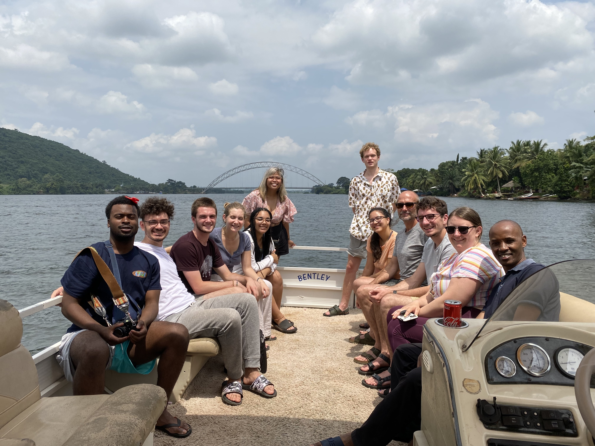
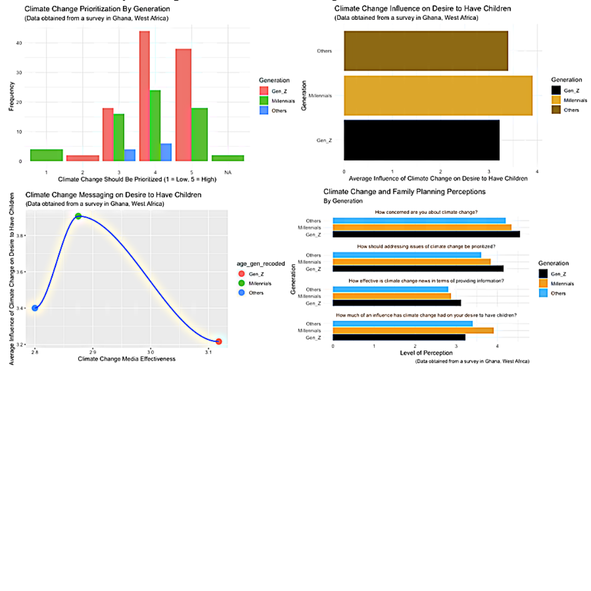
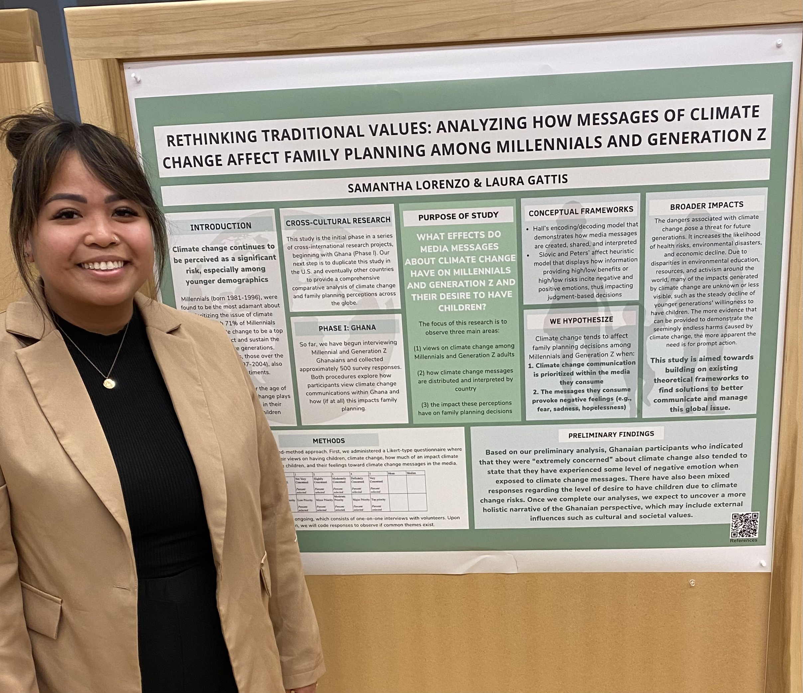
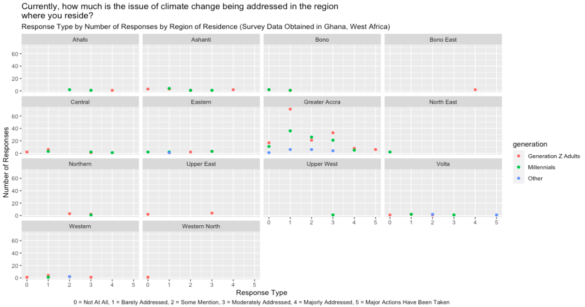

```{css, echo = FALSE}
.remark-slide-content {
  color: white;
  background-color: black;
}
```

# Rethinking Traditional Values: Analyzing How Messages of Climate Change Affect Family Planning Among Millennials and Generation Z (Phase I - Ghana)
### Authors: Samantha Lorenzo & Laura Gattis


---


---


---

# BACKGROUND



---

# STUDY OBJECTIVES

## The goal is to provide a comprehensive overview of this trend by focusing on three main areas:

### 1. Views of climate change among Millennials and Generation Z

### 2. The distribution and subsequent interpretation of media messages on climate change

### 3. The impact these perceptions have on family planning

---

# LAST TERM



---
# THIS TERM



---

# RESEARCH QUESTIONS

### Question 1: How concerned are you about climate change?

### Question 2: Currently, how much is the issue of climate change being addressed in the region
where you reside?

### Question 3: How much of an influence has climate change had on your desire to have children?

### Question 4: If issues of climate change were addressed more effectively, how much would it impact your
desire to have children?

---

# SAMPLE VISUALIZATION



---

# THANK YOU!


